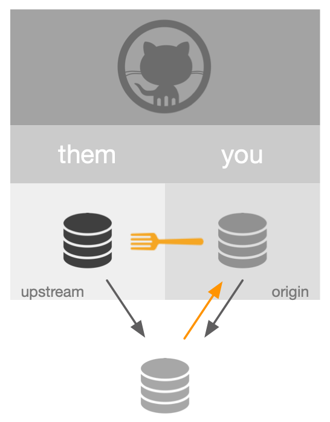

```{r setup, include=FALSE}
knitr::opts_chunk$set(
  echo = FALSE,
  code_folding = FALSE
)
```

"Fork and clone" is the basis for issuing the "pull requests" that are the lifeblood of open source development on github in the R universe. The purpose of this [*What I Learned Today*](https://orderlyquant.github.io/wilting/) post is to understand this workflow from two levels:

1.  the git/github concepts
2.  the `usethis` helper functions

Good reference information is found [here](https://usethis.r-lib.org/articles/articles/pr-functions.html).

## Fork and clone

To begin a "fork and clone" within the "happygitwithr" / `usethis` recommended workflow, run:

```{r, eval=FALSE}

usethis::create_from_github("OWNER/repo", "local_dir", fork = TRUE)

```

```{r fork-and-clone, layout="l-body", fig.width=300, code_folding=NULL}
knitr::include_graphics("images/fork-and-clone.png")
```

This accomplishes three things:

1.  A special copy, a **fork**, of `THEM/REPO` is made to your github account, referred to here as `YOU/REPO`.

2.  `YOU/REPO` is **cloned** to `local_dir` on your computer.

3.  git "remotes" are setup as follows:

    -   *origin*: `YOU/REPO`, can *push* and *pull*
    -   *upstream*: `THEM/REPO`, can *pull*, can't *push*

Best "pull request" practices dictate working on a local branch in order to avoid local merge conflicts and to ease the merge process for `OWNER` once the "pull request" is issued. To establish a local branch on which to do your work, run:

```{r, eval=FALSE}

usethis::pr_init("dev_branch")

```

This creates and switches to a local development branch, `local/dev_branch`, that is separate from the `local/main` branch. The allows your local repo to incorporate changes in `upstream`, i.e. keep up-to-date with development in `OWNER/REPO` while you develop locally.


## Develop

### Local development

Develop as usual, committing to `local/dev_branch` as appropriate via git tools included with Rstudio.

### Keeping up with OWNER

As necessary, and certainly recommended prior to issuing a "pull request", pull down any changes happening on `upstream/main` by running:

```{r, eval=FALSE}

usethis::pr_merge_main()

```

```{r merge-main, layout="l-body", fig.width=300, code_folding=NULL}
knitr::include_graphics("images/merge-main.png")
```

This brings `local/main` up-to-date with all development on `upstream/main`. This should happen without any issue if you haven't touched `local/main`, because that is where the updates are pulled to.

*My current understanding is that this doesn't perform any merge analysis between* `local/main` *and* `local/dev_branch`.

## Create pull request

When you are ready to make the pull request, run the following:

```{r, eval=FALSE}

usethis::pr_push()

```

```{r pr-push, layout="l-body", fig.width=300, code_folding=NULL}

```

This accomplishes the following:

- pushes your changes to your forked repo, `YOU/REPO`
- launches a browser window with the github page of `OWNER/REPO`
- makes available the "pull request" option within github

At this point, you work with submitting the pull request on github. For the purposes of this post, assume the pull request is accepted by `OWNER`. You finish the pull request locally by running:


```{r, eval=FALSE}

usethis::pr_finish()

```

This once again brings `local/main` up-to-date with `upstream/main`, which
now includes the changes incorporated in the accepted pull request. It
also has the effect of switching back to the default branch, `main` and
deleting the development branch `dev_branch`.

To make sure `OWNER/REPO` receives the changes of the merged pull request, in a shell run:

```{bash, eval=FALSE}
$ git push -f origin main
```

## Summary

```{r summary, eval=FALSE}

# 1. fork and clone
usethis::create_from_github("OWNER/repo", "local_dir", fork = TRUE)

# 2. create development branch
usethis::pr_init("dev_branch")

# do all development work, committing locally on local/dev_branch

# 3. pull changes from upstream
usethis::pr_merge_main()

# 4. initial pull request
usethis::pr_push()

# 5. clean up after pull request has been accepted and merged
usethis::pr_finish()

```


## Notes

- Called a "pull request", because at the end of the day, `YOU` are
  asking `OWNER` to pull your changes into the `OWNER/REPO/main`.
- "formal" names, like `OWNER/REPO` and "aliases" like `upstream` have
  been used interchangeably (sloppily?) to reinforce the concept that
  "aliases" are useful shorthand for "formal" names
- My sense is that the **fork**ed copy that sits in `YOU` is there
  largely for the purpose of being the basis of the pull request. In
  the documented `usethis` workflow, `pr_push()` is the only time that
  `YOU/REPO` gets updated during development of the pull request.
